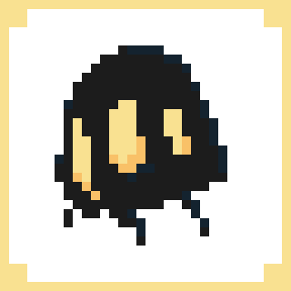
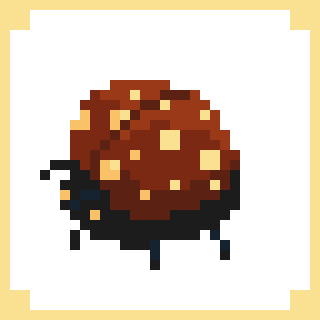
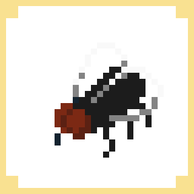
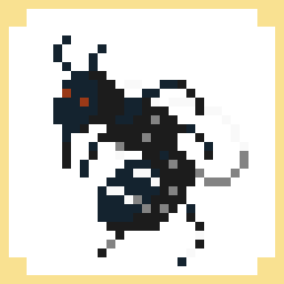
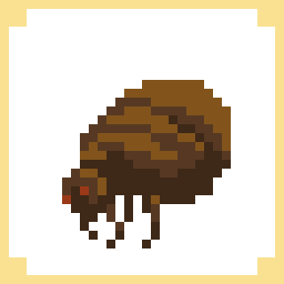

# bugScale
A funny way to measure your project's bug
BUGs

|Imagem | Nome | Força | Tipo | Descrição |
|-------|------|-------|------|-----------| 
| | Viuvinha | 1 | Any | Inofensiva. |
| | Joaninha | 2 | Design | Ficou até fofinho, mas não era pra ser assim. |
| |Mosca |5|Any|Não faz mal, mas incomoda|
| |Mosquito|8||Se você não matar não te deixa dormir|
| |Pulga|9||Fica escondido, lhe incomodando e pra tirar dá trabalho. |
||Barata|10|Design|Aquela tela que dá nojo|
||Vaga-Lume|10||O bug que você enxerga de longe. |
||Percevejo|20|Código|Você pode não estar vendo, mas pelo cheiro ele está ali.|
||Mariposa|30||Não é tão perigoso, mas as vezes assusta e para resolver dá trabalho.|
||Formiga|40||Parece inofensivo, mas quando aparece, aparece em bando. |
||Grilo|50||Você não sabe exatamente onde está, mas está ali|
||Besouro|50|||
||Gafanhoto|60|Memória|Come toda a memória disponível|
||Cupim|65|Memória|Come toda a memória disponível, antes que você perceba.|
||Taturana|70||Parece inofensivo, mas deixa lesões graves.|
||Abelha|80|Sobrecarga|Deixa a vítima com inchaço e muita dor|
||Vespa|100|Código.|Perigoso e difícil de matar.|

## Pixel Arts by [Maru](https://github.com/marumaia)